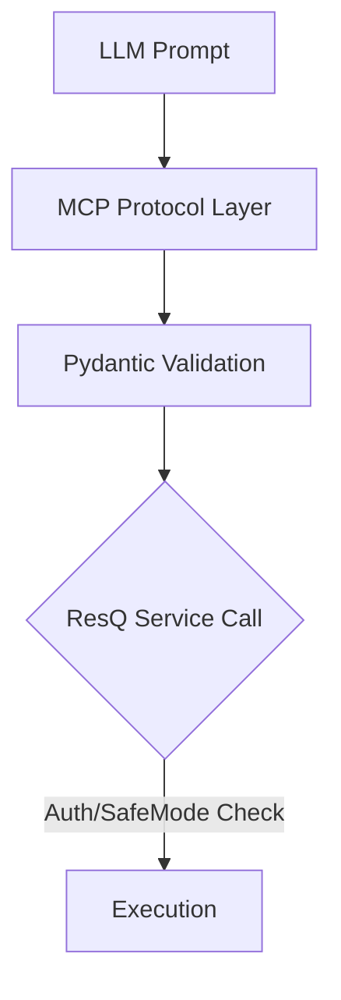

# resQ MCP Server


A production-ready Model Context Protocol (MCP) server that integrates ResQ platform robotics, simulation, and telemetry capabilities into AI agents.

---

## Overview

`resq-mcp` bridges the ResQ platform's core capabilities—Digital Twin Simulations (DTSOP), Hybrid Coordination Engines (HCE), and drone telemetry—directly to AI-powered environments like Claude Desktop, Cursor, and the MCP Inspector. It utilizes [FastMCP](https://github.com/jlowin/fastmcp) to expose secure, typed interfaces for mission-critical operations.

---

## Features

*   **Native Integration**: Domain-specific support for ResQ objects (DTSOP, HCE, PDIE).
*   **Flexible Transport**: Native support for both `STDIO` and `SSE` transport modes.
*   **Type Safety**: Built on strict Pydantic-based schemas for AI-tool reliability.
*   **Security Controls**: Integrated safe-mode prevents unauthorized mutations in production.

---

## Architecture

The server acts as a secure intermediary, translating AI natural language requests into authenticated, platform-native service calls.


---

## Installation

Ensure you have [uv](https://github.com/astral-sh/uv) installed, then clone the repository:

```bash
git clone https://github.com/resq-software/mcp.git
cd mcp
uv sync
```

**Local Development Setup:**

1.  **Clone Repository**: As shown above.
2.  **Install Dependencies**: Run `uv sync` within the cloned directory. This creates a virtual environment and installs all necessary Python packages defined in `pyproject.toml` and `uv.lock`.
3.  **Run Server**: Use `uv run resq-mcp` to start the server in STDIO mode for local integration.

**Production Environment Deployment:**

Production deployments typically involve containerization (e.g., Docker) or direct execution on a server.

1.  **Docker**: Build the image using the provided `Dockerfile`:
    ```bash
    docker build -t resq-mcp .
    ```
    Then run the container, exposing the necessary port:
    ```bash
    docker run -d -p 8000:8000 --name resq-mcp-server -e RESQ_API_KEY="your-production-api-key" resq-mcp
    ```
    Ensure `RESQ_API_KEY` is set securely.
2.  **Direct Execution**: On a target server, clone the repository, install dependencies via `uv sync`, and run the server with appropriate environment variables set:
    ```bash
    export RESQ_API_KEY="your-production-api-key"
    export RESQ_SAFE_MODE="true" # Or "false" if mutations are intended
    uv run resq-mcp
    ```
    Consider using a process manager like `systemd` or `supervisord` to manage the server process in production.

---

## Quick Start

### 1. Run in STDIO mode
For local integration with IDEs or desktop assistants:
```bash
uv run resq-mcp
```

### 2. Configure Claude Desktop
Add the following to your `claude_desktop_config.json`:
```json
{
  "mcpServers": {
    "resq": {
      "command": "uv",
      "args": ["run", "resq-mcp"],
      "env": { "RESQ_API_KEY": "your-prod-token" }
    }
  }
}
```

---

## Usage

The server exposes tools that allow AI agents to manage robotics operations directly.

### Request Lifecycle


---

## Configuration

Settings are managed via environment variables. Create a `.env` file in the project root:

| Variable          | Description                                                                | Default             |
| :---------------- | :------------------------------------------------------------------------- | :------------------ |
| `RESQ_API_KEY`    | Authentication token for platform access                                   | `resq-dev-token`    |
| `RESQ_SAFE_MODE`  | Prevents destructive platform mutations                                    | `true`              |
| `RESQ_PORT`       | Port for SSE (networked) mode                                              | `8000`              |
| `RESQ_HOST`       | Host to bind the SSE server to                                             | `0.0.0.0`           |
| `RESQ_DEBUG`      | Enable debug logging                                                       | `false`             |
| `RESQ_PROJECT_NAME` | Display name for the MCP server                                            | `resQ MCP Server`   |
| `RESQ_VERSION`    | Version string for the server                                              | `0.1.0`             |

---

## API Reference

### Core Modules

*   **DTSOP (Digital Twin Simulation & Optimization Platform)**: Manages physics-based digital twin simulations and generates RL-optimized deployment strategies.
    *   `run_simulation(request: SimulationRequest) -> str`: Queues a high-fidelity physics simulation job.
    *   `get_optimization_strategy(incident_id: str) -> OptimizationStrategy`: Retrieves RL-optimized strategy for a specific incident.
*   **HCE (Hybrid Coordination Engine)**: Coordinates hybrid operations and validates incidents.
    *   `validate_incident(val: IncidentValidation) -> str`: Evaluates sensor data against PDIE risk protocols.
    *   `update_mission_params(drone_id: str, strategy_id: str) -> MissionParameters | ErrorResponse`: Pushes authorized mission parameters to a specific drone.
*   **PDIE (Predictive Disaster Intelligence Engine)**: Handles predictive platform incident evaluation.
    *   `get_vulnerability_map(sector_id: str) -> VulnerabilityMap | ErrorResponse`: Retrieves precomputed vulnerability data for a sector.
    *   `get_predictive_alerts(sector_id: str) -> list[PreAlert] | ErrorResponse`: Generates probabilistic disaster forecasts for a sector.

### Key Resources

*   `resq://simulations/{sim_id}`: Provides real-time status and results for simulations. Supports SSE subscriptions.
*   `resq://drones/active`: Lists currently deployed drones, their status, battery levels, and assignments.

---

## Security Model

`resq-mcp` implements a two-tier security approach:

1.  **Authentication**: For SSE endpoints exposed via FastAPI (though not directly used in FastMCP's core transport), authentication is handled by `HTTPBearer` middleware, validating the `Authorization: Bearer <token>` header against the `RESQ_API_KEY` setting.
2.  **Safe Mode**: When `RESQ_SAFE_MODE=true` (the default), tools that perform platform mutations (e.g., `request_drone_deployment`, `run_simulation` in production) will raise a `FastMCPError` explaining that they are disabled in safe mode. This provides a sandbox environment for AI agents to interact with the system without causing real-world side effects. Setting `RESQ_SAFE_MODE=false` enables these operations.

---

## Development

### Troubleshooting

*   **Connection Refused (SSE)**: Ensure `RESQ_PORT` is correctly set and the port is not already in use by another process. If running in Docker, verify port mapping (`-p 8000:8000`).
*   **Schema Validation Errors**: Check that the data payloads sent by the AI agent (or test client) strictly adhere to the Pydantic models defined in `src/resq_mcp/models.py`. Use the MCP Inspector or FastMCP's built-in schema validation errors for debugging.
*   **Missing Environment Variables**: The server performs fail-fast validation on startup. If `RESQ_API_KEY` is missing (and not in dev mode), it will refuse to start. Ensure all necessary environment variables (or a `.env` file) are correctly configured.
*   **Safe Mode Issues**: If an AI agent tries to perform a mutation and gets a `FastMCPError` indicating safe mode, this is expected behavior. To enable mutations, set `RESQ_SAFE_MODE=false` in the environment.

### Standards

*   **Async First**: All tool, resource, and prompt handlers must be `async def` functions. Avoid blocking I/O operations. Use `httpx` for asynchronous HTTP requests.
*   **Type Safety**: Employ full type annotations for all parameters and return types. `mypy` is integrated into the CI pipeline and configured with strict checks (`strict = true`).
*   **Pydantic Models**: Use Pydantic models for all input and output data structures to ensure robust validation and clear contracts.
*   **Conventional Commits**: Adhere to the [Conventional Commits specification](https://www.conventionalcommits.org/) for commit messages. Git hooks are provided to enforce this.
*   **Dependencies**: Manage dependencies using `uv`. `uv sync` should be run after `git pull` if `uv.lock` changes.

### Adding New Platform Tools

1.  **Define Pydantic Models**: Create new models in `src/resq_mcp/models.py` for the tool's inputs and outputs.
2.  **Implement Tool Logic**: Write an `async def` function implementing the tool's functionality. Place it within a relevant module (e.g., `src/resq_mcp/tools.py`, `src/resq_mcp/dtsop.py`, etc.).
3.  **Register Tool**: Decorate the function with `@mcp.tool()`. Ensure the function signature uses the Pydantic models defined in step 1.
4.  **Add Docstring**: Provide a clear, concise docstring explaining the tool's purpose, arguments, return values, and any usage notes. This docstring is exposed to the AI agent as the tool description.
5.  **Write Tests**: Create corresponding unit tests in the `tests/` directory to verify the tool's behavior, including edge cases and error handling.
6.  **Update README**: Document the new tool in the relevant sections of the README if it represents a significant new capability.

---

## Contributing

1.  **Fork** the repository.
2.  **Branch**: Create a new branch with a descriptive name, prefixed by `feat/`, `fix/`, or `chore/` (e.g., `feat/add-new-simulation-type`).
3.  **Setup Environment**: Run `./scripts/setup.sh` to install Nix, enter the development shell, and set up git hooks.
4.  **Develop**: Implement your changes, adhering to the project's standards (async, type safety, Pydantic, Conventional Commits).
5.  **Lint & Test**: Run `uv run ruff check .` to lint and `uv run pytest` to run tests. Ensure all checks pass.
6.  **Commit**: Use `git commit` (the hooks will guide you).
7.  **Push**: Push your branch to your fork.
8.  **Pull Request**: Open a pull request against the `main` branch of the `resq-software/mcp` repository.

---

## License

Copyright 2026 ResQ. Distributed under the Apache License, Version 2.0. See [LICENSE](./LICENSE) for details.