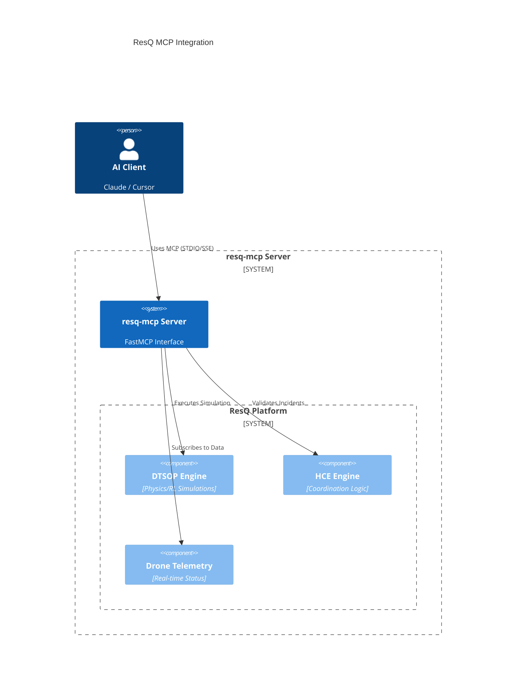

# ResQ MCP: Disaster Response Intelligence for AI

[](https://github.com/resq-software/mcp/actions)
[](https://pypi.org/project/resq-mcp/)
[](./LICENSE)

A production-ready Model Context Protocol (MCP) server that connects AI agents to the ResQ platform's robotics, physics simulations, and disaster telemetry.

---

## Capabilities

`resq-mcp` allows AI agents (Claude Desktop, Cursor, etc.) to command and monitor disaster response operations through a secure, typed interface.

*   **Drone Fleet Command**: Real-time telemetry, sector scanning, and autonomous swarm deployment via the Hybrid Coordination Engine (HCE).
*   **Predictive Intelligence**: Probabilistic disaster forecasting and sector-level vulnerability mapping (PDIE).
*   **Digital Twin Simulations**: Physics-based RL optimization strategies for incident response (DTSOP).
*   **Safe-Mode Execution**: Built-in protection prevents destructive platform mutations in production environments by default.

---

## Quick Start

### For End Users (Claude / Cursor)
Run the server instantly without manual cloning using `uvx`. Add this to your `claude_desktop_config.json`:

```json
{
  "mcpServers": {
    "resq": {
      "command": "uvx",
      "args": ["resq-mcp"],
      "env": { 
        "RESQ_API_KEY": "your-prod-token",
        "RESQ_SAFE_MODE": "true"
      }
    }
  }
}
```

### For Developers
Set up the local environment using [uv](https://github.com/astral-sh/uv):

```bash
git clone https://github.com/resq-software/mcp.git
cd mcp
uv sync
uv run resq-mcp
```

---

## Technical Architecture

The server acts as a secure intermediary, translating natural language requests into authenticated, platform-native service calls.



---

## Configuration

Control server behavior via environment variables or a `.env` file:

| Variable | Description | Default |
| :--- | :--- | :--- |
| `RESQ_API_KEY` | Platform authentication token | `resq-dev-token` |
| `RESQ_SAFE_MODE` | Prevents destructive mutations | `true` |
| `RESQ_PORT` | Port for SSE (networked) mode | `8000` |
| `RESQ_HOST` | Host to bind the SSE server | `0.0.0.0` |
| `RESQ_DEBUG` | Enable verbose logging | `false` |

---

## Security & Safety

**Safe Mode** is enabled by default (`RESQ_SAFE_MODE=true`). In this state, any tool that performs platform mutations (e.g., dispatching a drone swarm or starting a high-fidelity simulation) will raise a `FastMCPError`. This allows AI agents to "hallucinate" or plan missions safely without triggering real-world consequences. Disable this only when you are ready for autonomous execution.

---

## Tool Reference

### Mission Control (HCE)
- `validate_incident`: Evaluates sensor data against risk protocols.
- `update_mission_params`: Pushes mission parameters to specific drones.

### Simulation (DTSOP)
- `run_simulation`: Queues a high-fidelity physics simulation job.
- `get_optimization_strategy`: Retrieves RL-optimized strategies for incidents.

### Intelligence (PDIE)
- `get_vulnerability_map`: Precomputed vulnerability data for a sector.
- `get_predictive_alerts`: Probabilistic disaster forecasts.

### Fleet Status
- `resq://drones/active`: Resource URI for real-time drone status.
- `resq://simulations/{id}`: Resource URI for simulation progress.

---

## Contributing

We use `uv` for dependency management and `ruff` for linting. 

1.  **Setup**: `./scripts/setup.sh` (installs Nix dev-shell and git hooks).
2.  **Test**: `uv run pytest`
3.  **Lint**: `uv run ruff check .`

Distributed under the Apache-2.0 License. Copyright 2026 ResQ.
