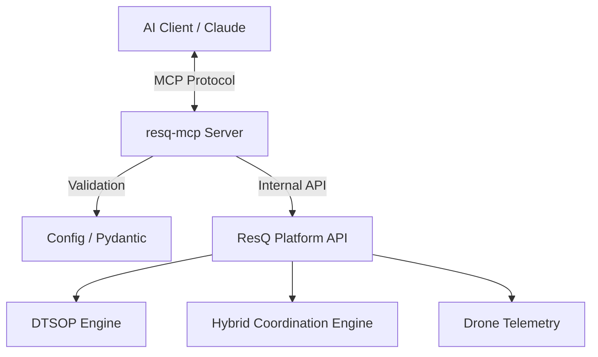

# resQ MCP Server


The **resQ MCP** repository provides a production-ready implementation of the [Model Context Protocol](https://modelcontextprotocol.io/), bridging the [ResQ platform's](https://resq.software) core capabilities—Digital Twin Simulations (DTSOP), Hybrid Coordination Engines (HCE), and drone telemetry—directly to AI-powered environments like Claude Desktop, Cursor, and the MCP Inspector.

---

## Table of Contents

- [Overview](#overview)
- [Features](#features)
- [Architecture](#architecture)
- [Quick Start](#quick-start)
- [Usage](#usage)
- [Configuration](#configuration)
- [API Overview](#api-overview)
- [Development](#development)
- [Contributing](#contributing)
- [Roadmap](#roadmap)
- [License](#license)

---

## Overview

`resq-mcp` is built upon [FastMCP](https://github.com/jlowin/fastmcp), enabling rapid integration of complex robotics and simulation workflows into LLMs. It acts as a secure intermediary between your AI agent and the ResQ backend.

### Core Modules
* **DTSOP**: Manages digital twin simulation lifecycles.
* **HCE**: Coordinates hybrid operations across diverse assets.
* **PDIE**: Handles platform-defined incident evaluation.
* **Telemetry**: Real-time streaming and monitoring of drone status.

---

## Features

* **Bi-directional Transport**: Supports `STDIO` for local integration and `SSE` for remote infrastructure.
* **Strong Typing**: Full Pydantic validation for all tool inputs and resource outputs.
* **Security-First**: Configurable `SAFE_MODE` to prevent destructive operations.
* **Event-Driven**: Asynchronous notification support for long-running simulations.
* **Ready-to-use Prompts**: Includes baked-in templates for incident response and analysis.

---

## Architecture

The system utilizes a modular Python backend with structured domain objects and standardized communication protocols.



---

## Quick Start

### 1. Prerequisites
Ensure you have [uv](https://github.com/astral-sh/uv) installed.

### 2. Installation
```bash
# Install package
uv add resq-mcp

# Or clone from source
git clone https://github.com/resq-software/mcp.git
cd mcp && uv sync
```

### 3. Execution
**Standard Mode (STDIO):**
```bash
uv run resq-mcp
```

**Networked Mode (SSE):**
```bash
RESQ_HOST=0.0.0.0 RESQ_PORT=8000 uv run resq-mcp
```

---

## Usage

### Connecting to Claude Desktop
Add this to your `~/Library/Application Support/Claude/claude_desktop_config.json`:

```json
{
  "mcpServers": {
    "resq": {
      "command": "uv",
      "args": ["run", "resq-mcp"],
      "env": { "RESQ_API_KEY": "your-prod-token" }
    }
  }
}
```

### Tool Invocation Example
Triggering an incident simulation:
```python
# Via AI Interface
# Tool: trigger_simulation
# Payload: { "incident_type": "wildfire", "location": {"lat": 37.7, "lon": -122.4} }
```

### Resource Subscription
Accessing live data:
```text
resq://drones/active
```

---

## Configuration

Settings are managed via environment variables and validated by `src/resq_mcp/config.py`.

| Variable | Description | Default |
| :--- | :--- | :--- |
| `RESQ_API_KEY` | Authentication token | `resq-dev-token` |
| `RESQ_SAFE_MODE` | If true, blocks mutation tools | `true` |
| `RESQ_DEBUG` | Verbose logging | `false` |
| `RESQ_PORT` | Port for SSE server | `8000` |

---

## API Overview

The server exposes several high-level endpoints:

* **`trigger_simulation`**: Starts a new DTSOP simulation instance.
* **`get_drone_telemetry`**: Polls active drone status or subscribes to events.
* **`validate_incident`**: Runs a check against PDIE protocols to assess threat levels.
* **`list_strategies`**: Retrieves cached deployment strategies for ongoing incidents.

Refer to `src/resq_mcp/tools.py` for granular parameter definitions.

---

## Development

The project includes pre-commit hooks and CI/CD pipelines to ensure code health.

### Setup
```bash
./scripts/setup.sh
```

### Testing
We use `pytest` with extensive mocking for the external ResQ API.
```bash
uv run pytest tests/
```

### Type Checking
```bash
uv run mypy src/
```

---

## Contributing

1. **Fork** the repository.
2. **Feature Branch**: Create a branch following `feat/`, `fix/`, or `refactor/` prefixes.
3. **Commit Convention**: Follow [Conventional Commits](https://www.conventionalcommits.org/).
4. **Pull Request**: Ensure CI passes (tests, linting, and coverage).

Check `CONTRIBUTING.md` for full coding standards.

---

## Roadmap

- [ ] Support for OAuth2 authentication flows.
- [ ] Extended telemetry visualization resources.
- [ ] Real-time WebSocket support for high-frequency updates.
- [ ] Plugin architecture for third-party coordination engines.

---

## License

Copyright 2026 ResQ. Distributed under the Apache License, Version 2.0. See [LICENSE](./LICENSE) for details.