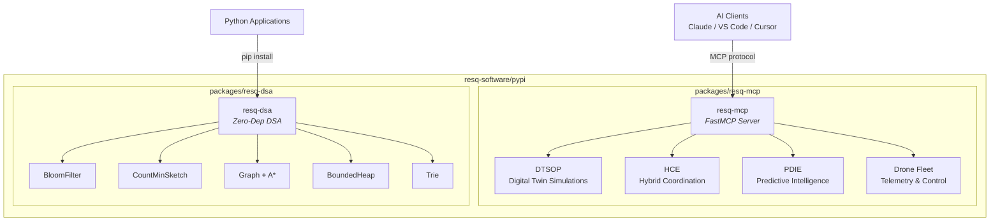
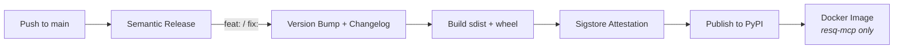

# ResQ PyPI Packages

[](https://github.com/resq-software/pypi/actions/workflows/ci.yml)
[](LICENSE)

Python packages for the [ResQ](https://github.com/resq-software) disaster response platform, published to PyPI under the [`resq-software`](https://pypi.org/org/resq-software/) organization.

## Packages

| Package | Description | Version |
|---------|-------------|---------|
| [`resq-mcp`](packages/resq-mcp/) | FastMCP server -- connects AI agents to drone fleet, simulations, and disaster intelligence | [](https://pypi.org/project/resq-mcp/) |
| [`resq-dsa`](packages/resq-dsa/) | Zero-dependency data structures & algorithms for search, rescue, and geospatial ops | [](https://pypi.org/project/resq-dsa/) |

## Architecture



## Quick Start

```bash
# Install a package
pip install resq-mcp   # MCP server for AI agents
pip install resq-dsa   # Data structures (zero dependencies)
```

## Development

```bash
# Clone and setup
git clone https://github.com/resq-software/pypi.git && cd pypi
./bootstrap.sh

# Work on a package
cd packages/resq-mcp && uv sync && uv run pytest
cd packages/resq-dsa && uv sync && uv run pytest
```

### Release Flow



Both packages use [python-semantic-release](https://python-semantic-release.readthedocs.io/) with [Trusted Publisher](https://docs.pypi.org/trusted-publishers/) OIDC. Conventional commits on `main` automatically version, changelog, and publish.

## License

[Apache-2.0](LICENSE) -- Copyright 2025 ResQ Software
