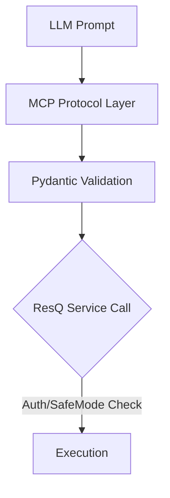

# resQ MCP Server


A production-ready Model Context Protocol (MCP) server that integrates ResQ platform robotics, simulation, and telemetry capabilities into AI agents.

---

## Overview

`resq-mcp` bridges the ResQ platform's core capabilities—Digital Twin Simulations (DTSOP), Hybrid Coordination Engines (HCE), and drone telemetry—directly to AI-powered environments like Claude Desktop, Cursor, and the MCP Inspector. It utilizes [FastMCP](https://github.com/jlowin/fastmcp) to expose secure, typed interfaces for mission-critical operations.

---

## Features

* **Native Integration**: Domain-specific support for ResQ objects (DTSOP, HCE, PDIE).
* **Flexible Transport**: Native support for both `STDIO` and `SSE` transport modes.
* **Type Safety**: Built on strict Pydantic-based schemas for AI-tool reliability.
* **Security Controls**: Integrated safe-mode prevents unauthorized mutations in production.

---

## Architecture

The server acts as a secure intermediary, translating AI natural language requests into authenticated, platform-native service calls.

```mermaid
c4Context
    title System Context: resq-mcp Integration

    Person(ai, "AI Client", "Claude Desktop / Cursor")
    System_Boundary(resq_boundary, "resq-mcp Server") {
        System(server, "resq-mcp Server", "MCP-compliant Interface")
        System_Boundary(backend, "ResQ Platform") {
            Component(dtsop, "DTSOP Engine", "Physics/RL Simulations")
            Component(hce, "HCE Engine", "Coordination Logic")
            Component(telemetry, "Drone Telemetry", "Real-time Status")
        }
    }

    Rel(ai, server, "Uses Model Context Protocol")
    Rel(server, dtsop, "Executes Simulation")
    Rel(server, hce, "Validates Incidents")
    Rel(server, telemetry, "Subscribes to Data")
```

---

## Installation

Ensure you have [uv](https://github.com/astral-sh/uv) installed, then clone the repository:

```bash
git clone https://github.com/resq-software/mcp.git
cd mcp
uv sync
```

---

## Quick Start

### 1. Run in STDIO mode
For local integration with IDEs or desktop assistants:
```bash
uv run resq-mcp
```

### 2. Configure Claude Desktop
Add the following to your `claude_desktop_config.json`:
```json
{
  "mcpServers": {
    "resq": {
      "command": "uv",
      "args": ["run", "resq-mcp"],
      "env": { "RESQ_API_KEY": "your-prod-token" }
    }
  }
}
```

---

## Usage

The server exposes tools that allow AI agents to manage robotics operations directly.

### Request Lifecycle


---

## Configuration

Settings are managed via environment variables. Create a `.env` file in the project root:

| Variable | Description | Default |
| :--- | :--- | :--- |
| `RESQ_API_KEY` | Authentication token for platform access | `resq-dev-token` |
| `RESQ_SAFE_MODE` | Prevents destructive platform mutations | `true` |
| `RESQ_PORT` | Port for SSE (networked) mode | `8000` |

---

## API Reference

### Core Modules
* **DTSOP**: Manages physics-based digital twin simulations.
* **HCE**: Coordinates hybrid operations across diverse assets.
* **PDIE**: Handles predictive platform incident evaluation.

### Key Endpoints
* `run_simulation`: Queues a high-fidelity physics simulation job.
* `get_deployment_strategy`: Retrieves RL-optimized strategy for a specific incident.
* `validate_incident`: Evaluates sensor data against PDIE risk protocols.

---

## Security Model

`resq-mcp` implements a two-tier security approach:
1. **Authentication**: Enforced via `RESQ_API_KEY` validated through `HTTPBearer` middleware on SSE connections.
2. **Safe Mode**: When `RESQ_SAFE_MODE=true` (default), tools that perform platform mutations (e.g., `request_drone_deployment`) will return a `FastMCPError` rather than executing, providing a sandbox environment for agent testing.

---

## Development

### Troubleshooting
* **Connection Refused**: Ensure `RESQ_PORT` is not already in use if running in SSE mode.
* **Schema Validation Errors**: Check that the `IncidentReport` payload matches the Pydantic schema in `models.py`.
* **Missing Env Vars**: Run `uv run resq-mcp` to trigger an immediate fail-fast validation check.

### Standards
- **Async First**: All handlers must be `async def`.
- **Typing**: Use full type annotations; `mypy` is enforced in CI.
- **Commits**: Follow [Conventional Commits](https://www.conventionalcommits.org/).

---

## Contributing

1. **Fork** the repository.
2. **Branch**: Use `feat/`, `fix/`, or `refactor/` prefixes.
3. **Lint**: Run `./scripts/setup.sh` to install git hooks.
4. **Test**: Execute `uv run pytest` before submitting PRs.

---

## License

Copyright 2026 ResQ. Distributed under the Apache License, Version 2.0. See [LICENSE](./LICENSE) for details.