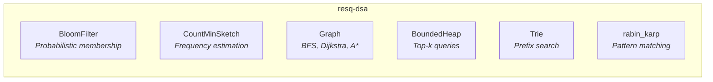

# resq-dsa

[](https://github.com/resq-software/pypi/actions/workflows/ci.yml)
[](https://pypi.org/project/resq-dsa/)
[](https://pypi.org/project/resq-dsa/)
[](https://github.com/resq-software/pypi/blob/main/LICENSE)

Production-grade data structures and algorithms for Python 3.11+. **Zero runtime dependencies** -- stdlib only.

## Installation

```bash
pip install resq-dsa
```

## What's Inside



| Structure | Use Case | Time Complexity |
|-----------|----------|-----------------|
| `BloomFilter` | Deduplication, membership testing | O(k) add/query |
| `CountMinSketch` | Stream frequency estimation | O(d) per update |
| `Graph` | Pathfinding, traversal | BFS O(V+E), Dijkstra O((V+E) log V) |
| `BoundedHeap` | Top-k nearest, priority queues | O(log k) insert |
| `Trie` | Autocomplete, prefix search | O(m) per operation |
| `rabin_karp` | Substring search | O(n+m) average |

## Usage

### BloomFilter

Space-efficient probabilistic set. No false negatives, tunable false positive rate.

```python
from resq_dsa import BloomFilter

bf = BloomFilter(capacity=100_000, error_rate=0.01)
bf.add("sensor-42")
bf.add("sensor-99")

bf.has("sensor-42")  # True  (definitely added)
bf.has("sensor-00")  # False (probably not added)
```

### Graph

Directed weighted graph with three pathfinding algorithms.

```python
from resq_dsa import Graph

g = Graph()
g.add_edge("HQ",      "Sector-1", 2.0)
g.add_edge("HQ",      "Sector-2", 5.0)
g.add_edge("Sector-1", "Sector-2", 1.0)
g.add_edge("Sector-2", "Evac",     3.0)

# BFS (unweighted traversal)
g.bfs("HQ")  # ['HQ', 'Sector-1', 'Sector-2', 'Evac']

# Dijkstra (shortest weighted path)
g.dijkstra("HQ", "Evac")
# {'path': ['HQ', 'Sector-1', 'Sector-2', 'Evac'], 'cost': 6.0}

# A* (heuristic-guided search)
g.astar("HQ", "Evac", h=lambda n, goal: 0)
# {'path': ['HQ', 'Sector-1', 'Sector-2', 'Evac'], 'cost': 6.0}
```

### CountMinSketch

Probabilistic frequency counter for high-throughput data streams.

```python
from resq_dsa import CountMinSketch

cms = CountMinSketch(epsilon=0.001, delta=0.01)
for event_id in event_stream:
    cms.increment(event_id)

cms.estimate("critical-alert-7")  # approximate count
```

### BoundedHeap

Fixed-capacity min-heap for tracking the top-k closest items.

```python
from resq_dsa import BoundedHeap

# Keep 3 nearest drones by distance
heap = BoundedHeap(limit=3, dist=lambda d: d["distance"])
heap.insert({"id": "D1", "distance": 5.2})
heap.insert({"id": "D2", "distance": 1.8})
heap.insert({"id": "D3", "distance": 3.4})
heap.insert({"id": "D4", "distance": 0.9})  # evicts D1 (farthest)

heap.items()  # [D4, D2, D3] -- 3 nearest
```

### Trie

Prefix tree for fast string storage, retrieval, and autocomplete.

```python
from resq_dsa import Trie

trie = Trie()
trie.insert("alert")
trie.insert("alarm")
trie.insert("alpha")

trie.search("alert")      # True
trie.starts_with("al")    # ['alarm', 'alert', 'alpha']
trie.starts_with("aler")  # ['alert']
```

### rabin_karp

Rolling-hash substring search -- finds all occurrences of a pattern.

```python
from resq_dsa import rabin_karp

rabin_karp("ababababab", "abab")  # [0, 2, 4, 6]
rabin_karp("hello world", "xyz") # []
```

## Design Principles

- **Zero dependencies** -- stdlib only, installs instantly, never breaks your dep tree
- **Type-safe** -- strict mypy, PEP 561 `py.typed` marker, full annotations
- **Tested** -- unit tests + algorithmic complexity verification via [big-O](https://github.com/pberkes/big_O)
- **Python 3.11+** -- uses modern syntax (match, `|` unions, slots)

## License

[Apache-2.0](https://github.com/resq-software/pypi/blob/main/LICENSE) -- Copyright 2025 ResQ Software
