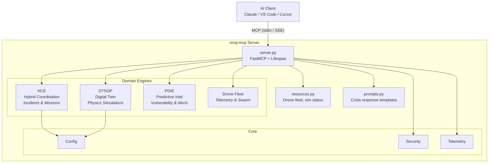
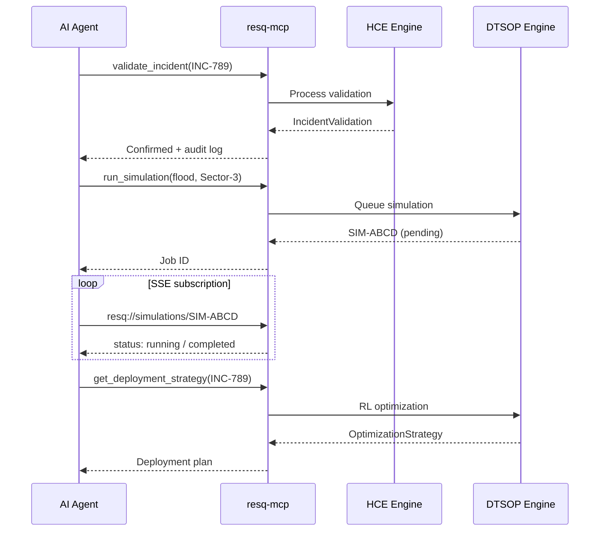

<!--
  Copyright 2026 ResQ

  Licensed under the Apache License, Version 2.0 (the "License");
  you may not use this file except in compliance with the License.
  You may obtain a copy of the License at

      http://www.apache.org/licenses/LICENSE-2.0

  Unless required by applicable law or agreed to in writing, software
  distributed under the License is distributed on an "AS IS" BASIS,
  WITHOUT WARRANTIES OR CONDITIONS OF ANY KIND, either express or implied.
  See the License for the specific language governing permissions and
  limitations under the License.
-->

# ResQ MCP: Disaster Response Intelligence for AI

[](https://github.com/resq-software/pypi/actions)
[](https://pypi.org/project/resq-mcp/)
[](https://hub.docker.com/r/resqsoftware/mcp)
[](https://github.com/resq-software/pypi/pkgs/container/mcp)
[](./LICENSE)

A production-ready Model Context Protocol (MCP) server that connects AI agents to the ResQ platform's robotics, physics simulations, and disaster telemetry.

### Key Features

- **Drone Fleet Command** — Real-time telemetry, sector scanning, and autonomous swarm deployment via the Hybrid Coordination Engine (HCE).
- **Predictive Intelligence** — Probabilistic disaster forecasting and sector-level vulnerability mapping (PDIE).
- **Digital Twin Simulations** — Physics-based RL optimization strategies for incident response (DTSOP).
- **Safe-Mode Execution** — Built-in protection prevents destructive platform mutations by default.

### Requirements

- Python 3.11 or newer
- VS Code, Cursor, Claude Desktop, or any other MCP client

---

## Getting Started

Install the ResQ MCP server with your client. The **standard config** works in most tools:

```json
{
  "mcpServers": {
    "resq": {
      "command": "uvx",
      "args": ["resq-mcp"],
      "env": {
        "RESQ_SAFE_MODE": "true"
      }
    }
  }
}
```

<details>
<summary>VS Code</summary>

A pre-configured [`.vscode/mcp.json`](.vscode/mcp.json) is included in this repo — just open the project and the server is available.

Or install manually. Add to your user or workspace `mcp.json`:

```json
{
  "servers": {
    "resq-mcp": {
      "type": "stdio",
      "command": "uvx",
      "args": ["resq-mcp"],
      "env": {
        "RESQ_SAFE_MODE": "true"
      }
    }
  }
}
```

For local development (from a cloned repo), replace `"command": "uvx"` and `"args"` with `"command": "uv"` and `"args": ["run", "resq-mcp"]`.

</details>

<details>
<summary>Claude Desktop</summary>

Add to your `claude_desktop_config.json` ([MCP install guide](https://modelcontextprotocol.io/quickstart/user)):

```json
{
  "mcpServers": {
    "resq": {
      "command": "uvx",
      "args": ["resq-mcp"],
      "env": {
        "RESQ_API_KEY": "your-prod-token",
        "RESQ_SAFE_MODE": "true"
      }
    }
  }
}
```

</details>

<details>
<summary>Claude Code</summary>

```bash
claude mcp add resq -- uvx resq-mcp
```

</details>

<details>
<summary>Cursor</summary>

Go to `Cursor Settings` → `MCP` → `Add new MCP Server`. Use `command` type with the command `uvx resq-mcp`.

Or add manually to your MCP config:

```json
{
  "mcpServers": {
    "resq": {
      "command": "uvx",
      "args": ["resq-mcp"]
    }
  }
}
```

</details>

<details>
<summary>Windsurf</summary>

Follow Windsurf MCP [documentation](https://docs.windsurf.com/windsurf/cascade/mcp). Use the standard config above.

</details>

<details>
<summary>Docker</summary>

Run the server as a container in SSE mode:

```json
{
  "mcpServers": {
    "resq": {
      "command": "docker",
      "args": [
        "run", "-i", "--rm", "--init",
        "-e", "RESQ_SAFE_MODE=true",
        "resqsoftware/mcp"
      ]
    }
  }
}
```

Or pull from GitHub Container Registry:

```bash
docker pull ghcr.io/resq-software/pypi:latest
```

To run as a long-lived SSE service:

```bash
docker run -d --rm --init \
  --name resq-mcp \
  -p 8000:8000 \
  -e RESQ_SAFE_MODE=true \
  resqsoftware/mcp
```

Then point your MCP client at the HTTP endpoint:

```json
{
  "mcpServers": {
    "resq": {
      "url": "http://localhost:8000/mcp"
    }
  }
}
```

You can also build the image yourself:

```bash
docker build -t resq-mcp .
```

</details>

<details>
<summary>Local development</summary>

```bash
git clone https://github.com/resq-software/pypi.git
cd pypi/packages/resq-mcp
uv sync
uv run resq-mcp
```

</details>

---

## Configuration

Control server behavior via environment variables or a `.env` file:

| Variable | Description | Default |
| :--- | :--- | :--- |
| `RESQ_API_KEY` | Platform authentication token | `resq-dev-token` |
| `RESQ_SAFE_MODE` | Prevents destructive mutations | `true` |
| `RESQ_PORT` | Port for SSE (networked) mode | `8000` |
| `RESQ_HOST` | Host to bind the SSE server | `0.0.0.0` |
| `RESQ_DEBUG` | Enable verbose logging | `false` |
| `RESQ_TELEMETRY_BACKEND` | Observability backend (`none`, `console`, `jaeger`, `otlp`) | `none` |
| `RESQ_OTEL_EXPORTER_OTLP_ENDPOINT` | OTLP exporter endpoint (when backend is `otlp`) | `http://localhost:4317` |
| `RESQ_OTEL_SERVICE_NAME` | Service name reported to the telemetry backend | `resq-mcp` |

> **Note**: `RESQ_API_KEY` defaults to `resq-dev-token` for local development. No external token is needed to run the server — it works out of the box.

---

## Security & Safety

**Safe Mode** is enabled by default (`RESQ_SAFE_MODE=true`). In this state, any tool that performs platform mutations (e.g., dispatching a drone swarm or starting a high-fidelity simulation) will raise a `FastMCPError`. This allows AI agents to plan missions safely without triggering real-world consequences. Disable this only when you are ready for autonomous execution.

---

## Tools

### Mission Control (HCE)

- **validate_incident** — Submit a confirmation or rejection for an incident report. Supports idempotent re-submission and conflict detection for opposing validations.
  - Parameters: `incident_id`, `is_confirmed`, `validation_source`, `correlated_pre_alert_id` (optional), `notes`

- **update_mission_params** — Push authorized mission parameters to a specific drone for an approved strategy. Includes urgency escalation, conflict guards, and idempotent re-dispatch.
  - Parameters: `drone_id`, `strategy_id`, `is_urgent` (optional, default `false`)

### Simulation (DTSOP)

- **run_simulation** — Queue a high-fidelity Digital Twin physics simulation (flood, wildfire, earthquake). Returns a job ID — subscribe to the resource URI for progress updates.
  - Parameters: `scenario_id`, `sector_id`, `disaster_type`, `parameters`, `priority`

- **get_deployment_strategy** — Generate an RL-optimized drone deployment and evacuation strategy for a confirmed incident or PDIE pre-alert.
  - Parameters: `incident_id`

### Resources

| URI | Description |
| :--- | :--- |
| `resq://drones/active` | Real-time fleet status — drone types, battery levels, sector assignments. |
| `resq://simulations/{sim_id}` | Simulation progress and results. Supports SSE subscriptions for push updates on state transitions. |

### Prompts

| Prompt | Description |
| :--- | :--- |
| `incident_response_plan` | Structured crisis coordination template that guides an AI agent through situation analysis, asset allocation, and risk assessment for a given incident. |

---

## Example Workflows

### Run a Flood Simulation

```
You:   "Run a flood simulation for Sector-3 with water level 4.2m"
Agent: Calls run_simulation → receives SIM-ABCD1234
       Subscribes to resq://simulations/SIM-ABCD1234
       Waits for status: completed
       Returns result URL and analysis
```

### Full Incident Response

```
You:   "Validate incident INC-789 and deploy drones"
Agent: 1. Calls validate_incident(INC-789, confirmed=True)
       2. Calls get_deployment_strategy("INC-789")
       3. Reviews strategy with operator
       4. Calls update_mission_params("DRONE-Alpha", "STRAT-XYZ", urgent=True)
       5. Returns mission parameters and audit hash
```

### Crisis Planning with Prompts

```
You:   Use the incident_response_plan prompt for INC-456
Agent: Receives structured template → calls tools → produces:
       - Situation Summary
       - Asset Allocation
       - Risk Assessment
```

---

## Architecture



### Request Flow



### Module Layout

```
src/resq_mcp/
├── server.py              # FastMCP init, lifespan, background tasks
├── resources.py           # @mcp.resource() endpoints (drones, sims)
├── prompts.py             # @mcp.prompt() templates (incident response)
├── core/                  # Cross-cutting: config, errors, security, telemetry, timeout
├── drone/                 # Drone feed: scan, swarm, deployment (models + service)
├── dtsop/                 # Digital Twin: simulation, optimization (models + service + tools)
├── hce/                   # Hybrid Coordination: incidents, missions (models + service + tools)
└── pdie/                  # Predictive Intelligence: vulnerability, alerts (models + service)
```

---

## Contributing

We use `uv` for dependency management and `ruff` for linting.

1.  **Setup**: `uv sync` (installs all dependencies including dev group).
2.  **Test**: `uv run pytest`
3.  **Lint**: `uv run ruff check .`

Distributed under the Apache-2.0 License. Copyright 2026 ResQ.
